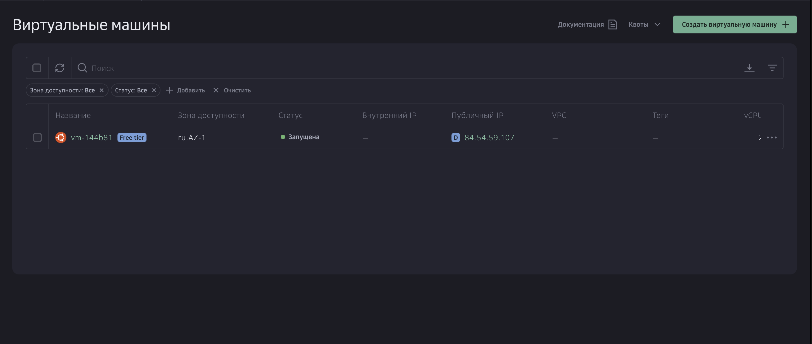
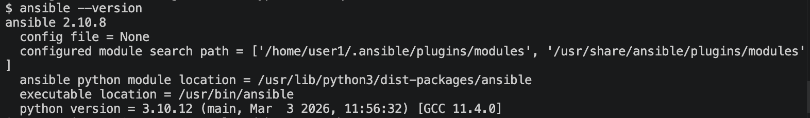
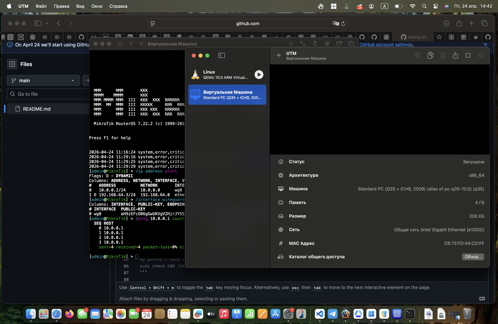
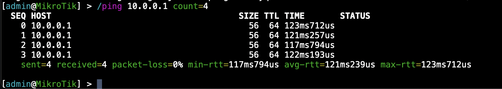

# 2024_2025-network_programming-k3320-igor-yakovlev

University: [ITMO University](https://itmo.ru/ru/)
Faculty: [FICT](https://fict.itmo.ru)
Course: [Network programming](https://github.com/itmo-ict-faculty/network-programming)
Year: 2025/2026
Group: K3320
Author: Yakovlev Igor Sergeevich
Lab: Lab1
Date of create: 24.04.2026
Date of finished: 24.04.2026

# Лабораторная работа №1 "Установка CHR и Ansible, настройка VPN"

## Описание

Данная работа предусматривает обучение развертыванию виртуальных машин (VM) и системы контроля конфигураций Ansible, а также организации собственных VPN серверов.

## Цель работы

Целью данной работы является развертывание виртуальной машины на базе облачного провайдера с установленной системой контроля конфигураций Ansible и установка CHR в средство виртуализации, а также организация VPN туннеля между сервером автоматизации и CHR с помощью WireGuard.

## Ход работы

### 1. Виртуальная машина в облаке

В качестве облачного провайдера был выбран cloud.ru 

Была развёрнута ВМ со следующими параметрами:
- ОС: Ubuntu 22.04
- Сетевой интерфейс: Публичный IP (84.54.59.107)
- Группа безопасности: SSH-access_ru.AZ-1



### 2. Установка Python и Ansible

После подключения к ВМ по SSH были обновлены пакеты и установлено необходимое ПО:

```bash
sudo apt update && sudo apt upgrade -y
sudo apt install python3-pip -y
sudo apt install ansible -y
```

Проверка установки:

```
$ ansible --version
ansible 2.10.8
  config file = None
  configured module search path = ['/home/user1/.ansible/plugins/modules', '/usr/share/ansible/plugins/modules']
  ansible python module location = /usr/lib/python3/dist-packages/ansible
  executable location = /usr/bin/ansible
  python version = 3.10.12 (main, Mar  3 2026, 11:56:32) [GCC 11.4.0]
```



### 3. Настройка MikroTik CHR

На MacOS (Apple Silicon) VirtualBox не подошёл из-за несоответствия архитектур: VirtualBox предлагает Linux ARM64, тогда как CHR требует x86_64. В качестве средства виртуализации был выбран **UTM** с эмуляцией x86_64.

Был скачан образ MikroTik CHR 7.22.2 (Raw disk image, x86).

Настройка UTM:
1. Создана новая ВМ в режиме Emulate, архитектура x86_64
2. Отключены UEFI Boot и RNG
3. Добавлен последовательный порт (Serial) для управления
4. Сетевой режим: Общая сеть (Shared Network)
5. Импортирован диск chr-7.22.2.img (128 МБ)

После запуска ВМ RouterOS 7.22.2 успешно загрузился.



### 4. Настройка WireGuard сервера на ВМ

WireGuard был выбран как VPN-протокол за простоту настройки и высокую производительность.

#### Установка и генерация ключей

```bash
sudo apt install wireguard -y
wg genkey | sudo tee /etc/wireguard/server_private.key | wg pubkey | sudo tee /etc/wireguard/server_public.key
sudo chmod 600 /etc/wireguard/server_private.key
```

#### Включение IP-форвардинга

```bash
sudo sysctl -w net.ipv4.ip_forward=1
echo "net.ipv4.ip_forward=1" | sudo tee -a /etc/sysctl.conf
```

#### Конфигурация сервера (/etc/wireguard/wg0.conf)

```ini
[Interface]
Address = 10.0.0.1/24
ListenPort = 51820
PrivateKey = <server_private_key>
PostUp = iptables -A FORWARD -i wg0 -j ACCEPT; iptables -t nat -A POSTROUTING -o enp3s0 -j MASQUERADE
PostDown = iptables -D FORWARD -i wg0 -j ACCEPT; iptables -t nat -D POSTROUTING -o enp3s0 -j MASQUERADE

[Peer]
PublicKey = MWfzj3RcANQ1SpERLNq2C2Ez9WcTSQxyd90BE74K/VY=
AllowedIPs = 10.0.0.2/32
```

#### Запуск WireGuard

```bash
sudo systemctl enable wg-quick@wg0
sudo systemctl start wg-quick@wg0
```

В группе безопасности cloud.ru было добавлено правило для входящего трафика: UDP, порт 51820, источник 0.0.0.0/0.

### 5. Настройка WireGuard клиента на MikroTik CHR

#### Создание интерфейса WireGuard

```
/interface wireguard add name=wg0 listen-port=13231
```

#### Добавление пира (сервера)

```
/interface wireguard peers add interface=wg0 public-key="aH9zEFcOB6gGwUKVgV2HjrJYSSnTp+ngsClKD8yq2xM=" endpoint-address=84.54.59.107 endpoint-port=51820 allowed-address=10.0.0.0/24 persistent-keepalive=25
```

#### Назначение IP-адреса

```
/ip address add address=10.0.0.2/24 interface=wg0
```

### 6. Проверка связности

Состояние туннеля на сервере:

```
$ sudo wg show
interface: wg0
  public key: aH9zEFcOB6gGwUKVgV2HjrJYSSnTp+ngsClKD8yq2xM=
  private key: (hidden)
  listening port: 51820

peer: MWfzj3RcANQ1SpERLNq2C2Ez9WcTSQxyd90BE74K/VY=
  endpoint: 141.136.42.37:42832
  allowed ips: 10.0.0.2/32
  latest handshake: 29 seconds ago
  transfer: 212 B received, 92 B sent
```

Пинг с сервера до CHR:

```
$ ping -c 4 10.0.0.2
PING 10.0.0.2 (10.0.0.2) 56(84) bytes of data.
64 bytes from 10.0.0.2: icmp_seq=1 ttl=64 time=126 ms
64 bytes from 10.0.0.2: icmp_seq=2 ttl=64 time=119 ms
64 bytes from 10.0.0.2: icmp_seq=3 ttl=64 time=115 ms
64 bytes from 10.0.0.2: icmp_seq=4 ttl=64 time=124 ms

--- 10.0.0.2 ping statistics ---
4 packets transmitted, 4 received, 0% packet loss, time 3004ms
```

Пинг с CHR до сервера:

```
[admin@MikroTik] > /ping 10.0.0.1 count=4
  SEQ HOST                                     SIZE TTL TIME       STATUS
    0 10.0.0.1                                   56  64 123ms712us
    1 10.0.0.1                                   56  64 121ms257us
    2 10.0.0.1                                   56  64 117ms794us
    3 10.0.0.1                                   56  64 122ms193us
    sent=4 received=4 packet-loss=0% min-rtt=117ms794us avg-rtt=121ms239us max-rtt=123ms712us
```



### Схема сети

```
┌─────────────────────┐         WireGuard VPN         ┌─────────────────────┐
│   Cloud VM (Ubuntu)  │        UDP port 51820         │  Локальный ПК (Mac) │
│                     │◄──────────────────────────────►│                     │
│  Ansible + WireGuard │       10.0.0.1 <-> 10.0.0.2  │  UTM + MikroTik CHR │
│  84.54.59.107       │                                │  (эмуляция x86_64)  │
└─────────────────────┘                                └─────────────────────┘
```

## Заключение

В результате выполнения лабораторной работы была развёрнута виртуальная машина в облаке (cloud.ru, Ubuntu 22.04) с установленным Ansible 2.10.8, настроен MikroTik CHR 7.22.2 в эмуляторе UTM на MacOS (Apple Silicon), и организован VPN-туннель с помощью WireGuard между сервером автоматизации (10.0.0.1) и CHR (10.0.0.2). IP-связность подтверждена пингом в обе стороны с 0% потерь.

## Справочные материалы

- https://www.wireguard.com/quickstart/
- https://help.mikrotik.com/docs/spaces/ROS/pages/69664792/WireGuard
- https://github.com/tikoci/chr-utm
