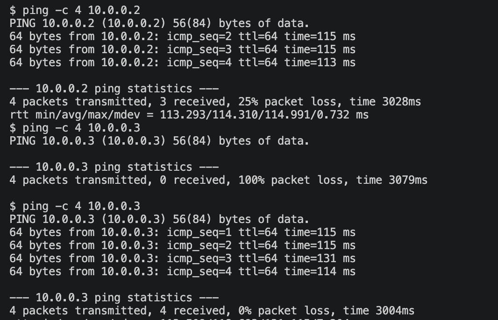
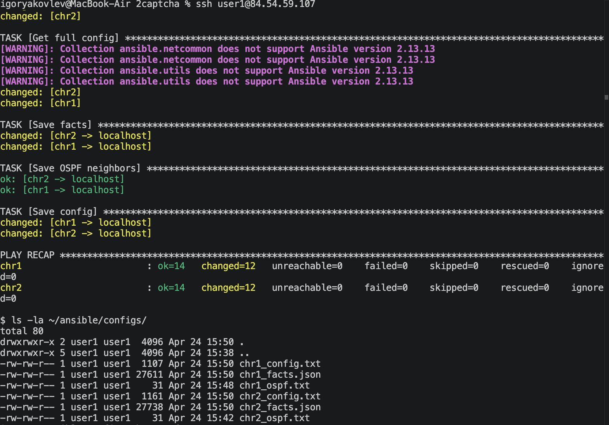
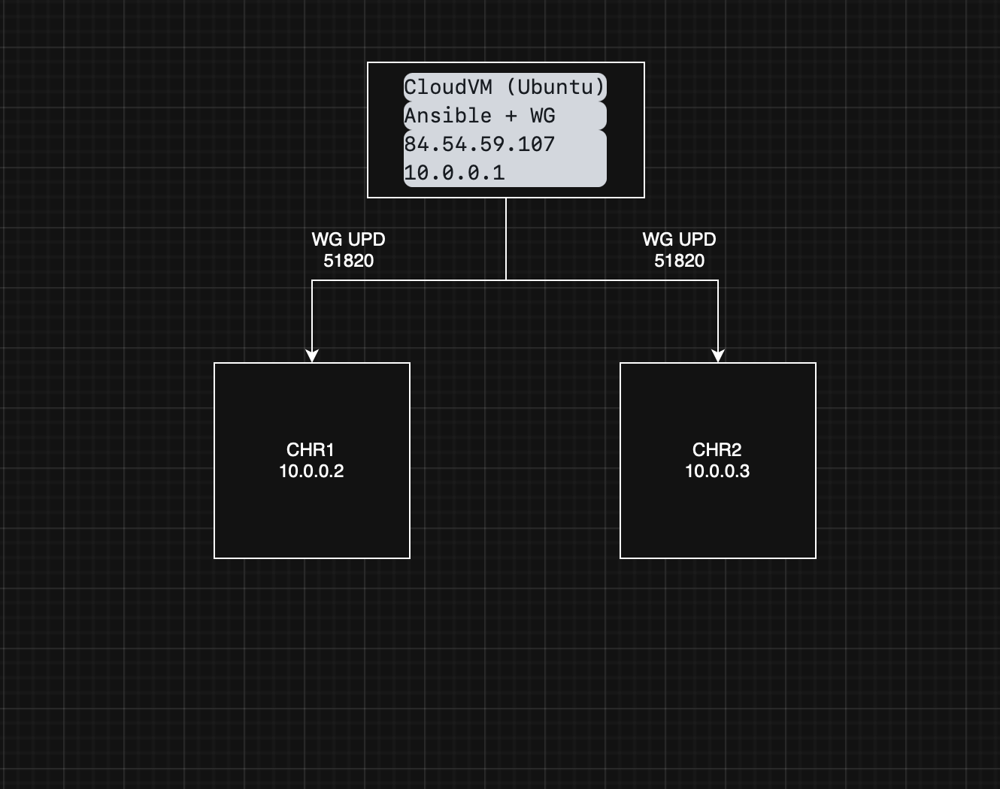

University: [ITMO University](https://itmo.ru/ru/)
Faculty: [FICT](https://fict.itmo.ru)
Course: [Network programming](https://github.com/itmo-ict-faculty/network-programming)
Year: 2025/2026
Group: K3320
Author: Yakovlev Igor Sergeevich
Lab: Lab2
Date of create: 23.04.2026
Date of finished: 24.04.2026

# Лабораторная работа №2 "Развертывание дополнительного CHR, первый сценарий Ansible"

## Описание

В данной лабораторной работе на практике происходит знакомство с системой управления конфигурацией Ansible, использующейся для автоматизации настройки и развертывания программного обеспечения.

## Цель работы

С помощью Ansible настроить несколько сетевых устройств и собрать информацию о них. Правильно собрать файл Inventory.

## Ход работы

### 1. Второй CHR

Второй MikroTik CHR был развёрнут в UTM путём клонирования первой ВМ. После запуска WireGuard интерфейс был пересоздан для получения нового ключа, настроен пир и назначен IP-адрес 10.0.0.3.

На сервере был добавлен второй пир:

```bash
sudo wg set wg0 peer ImSh1FJZ8hw4ByIac5yXlt+nkeBlTzZk6VpNwxYcAxI= allowed-ips 10.0.0.3/32
```

Проверка связности с сервера:

```
$ ping -c 4 10.0.0.2
4 packets transmitted, 3 received, 25% packet loss
$ ping -c 4 10.0.0.3
4 packets transmitted, 4 received, 0% packet loss
```



### 2. Структура Ansible-проекта

```
~/ansible/
├── inventory.ini
├── playbook.yml
├── group_vars/
│   └── mikrotik.yml
├── host_vars/
│   ├── chr1/
│   │   └── vars.yml
│   └── chr2/
│       └── vars.yml
└── configs/
```

### 3. Inventory

```ini
[mikrotik]
chr1 ansible_host=10.0.0.2
chr2 ansible_host=10.0.0.3

[mikrotik:vars]
ansible_connection=ansible.netcommon.network_cli
ansible_network_os=community.routeros.routeros
ansible_user=admin
ansible_password=admin
```

### 4. Переменные

Общие переменные (group_vars/mikrotik.yml):

```yaml
ntp_server: 216.239.35.0
new_user: lab_user
new_password: lab_password123
```

Переменные chr1 (host_vars/chr1/vars.yml):

```yaml
loopback_ip: 1.1.1.1
router_id: 1.1.1.1
```

Переменные chr2 (host_vars/chr2/vars.yml):

```yaml
loopback_ip: 2.2.2.2
router_id: 2.2.2.2
```

### 5. Плейбук

```yaml
- name: Lab2 - MikroTik CHR Configuration
  hosts: mikrotik
  gather_facts: no

  tasks:
    - name: Set system identity
      community.routeros.command:
        commands:
          - /system identity set name={{ inventory_hostname }}

    - name: Create user
      community.routeros.command:
        commands:
          - /user add name={{ new_user }} password={{ new_password }} group=full
      ignore_errors: yes

    - name: Configure NTP client
      community.routeros.command:
        commands:
          - /system ntp client set enabled=yes servers={{ ntp_server }}

    - name: Create loopback bridge
      community.routeros.command:
        commands:
          - /interface bridge add name=loopback0
      ignore_errors: yes

    - name: Add loopback IP
      community.routeros.command:
        commands:
          - /ip address add address={{ loopback_ip }}/32 interface=loopback0
      ignore_errors: yes

    - name: Configure OSPF instance
      community.routeros.command:
        commands:
          - /routing ospf instance add name=ospf-instance version=2 router-id={{ router_id }}
      ignore_errors: yes

    - name: Configure OSPF area
      community.routeros.command:
        commands:
          - /routing ospf area add name=backbone area-id=0.0.0.0 instance=ospf-instance
      ignore_errors: yes

    - name: Configure OSPF interfaces
      community.routeros.command:
        commands:
          - /routing ospf interface-template add interfaces=wg0,loopback0 area=backbone type=ptp
      ignore_errors: yes

    - name: Gather facts
      community.routeros.facts:
        gather_subset: all
      register: chr_facts

    - name: Get OSPF neighbors
      community.routeros.command:
        commands:
          - /routing ospf neighbor print detail
      register: ospf_neighbors

    - name: Get full config
      community.routeros.command:
        commands:
          - /export
      register: full_config

    - name: Save facts
      delegate_to: localhost
      copy:
        content: "{{ chr_facts.ansible_facts | to_nice_json }}"
        dest: "./configs/{{ inventory_hostname }}_facts.json"

    - name: Save OSPF neighbors
      delegate_to: localhost
      copy:
        content: "{{ ospf_neighbors.stdout[0] }}"
        dest: "./configs/{{ inventory_hostname }}_ospf.txt"

    - name: Save config
      delegate_to: localhost
      copy:
        content: "{{ full_config.stdout[0] }}"
        dest: "./configs/{{ inventory_hostname }}_config.txt"
```

### 6. Результат выполнения плейбука

```
PLAY RECAP
chr1  : ok=14   changed=13   unreachable=0   failed=0
chr2  : ok=14   changed=13   unreachable=0   failed=0
```

Собранные файлы:

```
configs/
├── chr1_config.txt
├── chr1_facts.json
├── chr1_ospf.txt
├── chr2_config.txt
├── chr2_facts.json
└── chr2_ospf.txt
```



### 7. Конфигурация устройств

Конфигурация chr1:

```
/interface bridge
add name=loopback0
/interface wireguard
add listen-port=13231 mtu=1420 name=wg0
/routing ospf instance
add name=ospf-instance router-id=1.1.1.1
/routing ospf area
add instance=ospf-instance name=backbone
/interface wireguard peers
add allowed-address=10.0.0.0/24 endpoint-address=84.54.59.107 endpoint-port=51820
    interface=wg0 persistent-keepalive=25s
/ip address
add address=10.0.0.2/24 interface=wg0
add address=1.1.1.1 interface=loopback0
/routing ospf interface-template
add area=backbone interfaces=wg0,loopback0 type=ptp
/system identity
set name=chr1
/system ntp client
set enabled=yes
/system ntp client servers
add address=216.239.35.0
```
Конфигурация chr2:
```
# 2026-04-24 12:50:21 by RouterOS 7.22.2
# system id = nLMDPRf4ExO
#
/interface bridge
add name=loopback0
/interface ethernet
set [ find default-name=ether1 ] disable-running-check=no
/interface wireguard
add listen-port=13231 mtu=1420 name=wg0
/routing ospf instance
add name=ospf-instance router-id=2.2.2.2
add name=ospf-instance router-id=2.2.2.2
/routing ospf area
add instance=ospf-instance name=backbone
add instance=ospf-instance name=backbone
/interface wireguard peers
add allowed-address=10.0.0.0/24 endpoint-address=84.54.59.107 endpoint-port=\
    51820 interface=wg0 name=peer2 persistent-keepalive=25s public-key=\
    "aH9zEFcOB6gGwUKVgV2HjrJYSSnTp+ngsClKD8yq2xM="
/ip address
add address=10.0.0.2/24 interface=*3 network=10.0.0.0
add address=10.0.0.3/24 interface=wg0 network=10.0.0.0
add address=2.2.2.2 interface=loopback0 network=2.2.2.2
/ip dhcp-client
add interface=ether1 name=client1
/routing ospf interface-template
add area=backbone interfaces=wg0,loopback0 type=ptp
add area=backbone interfaces=wg0,loopback0 type=ptp
/system identity
set name=chr2
/system ntp client
set enabled=yes
/system ntp client servers
add address=216.239.35.0
```
### Схема сети


## Заключение

В ходе работы был создан второй роутер CHR, подключённый к WireGuard VPN серверу. Была настроена система управления конфигурацией Ansible с файлами inventory, group_vars, host_vars. Написан плейбук, который на обоих CHR настраивает: нового пользователя, NTP-клиент, OSPF маршрутизацию с уникальным Router ID. Также плейбук собирает факты, OSPF-соседей и полные конфигурации устройств в файлы.

## Справочные материалы

- https://docs.ansible.com/ansible/latest/network/getting_started/
- https://docs.ansible.com/ansible/latest/collections/community/routeros/
- https://help.mikrotik.com/docs/spaces/ROS/pages/328151/OSPF
